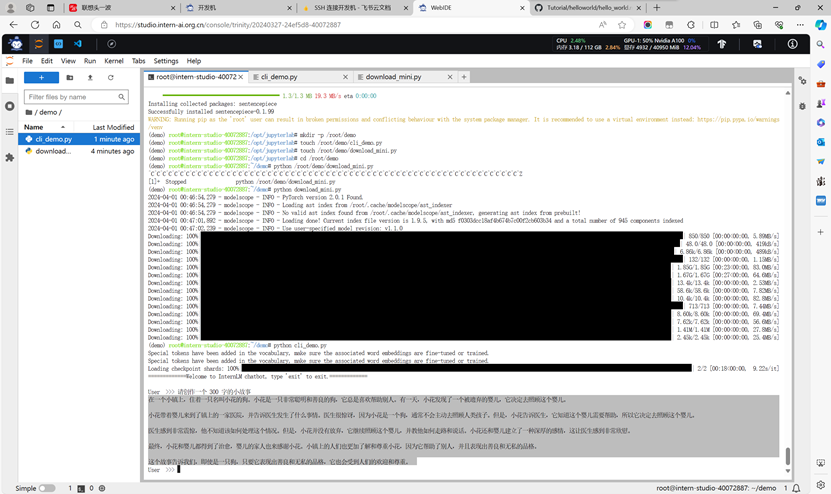
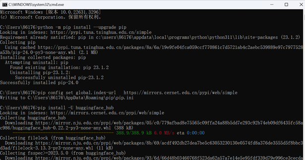
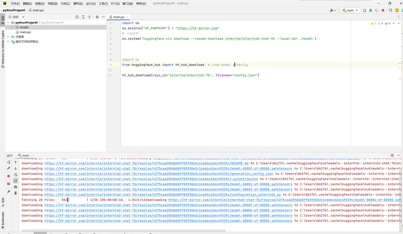
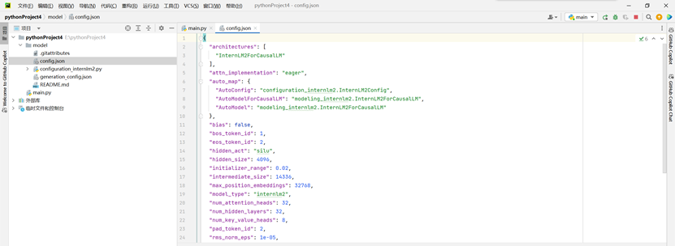
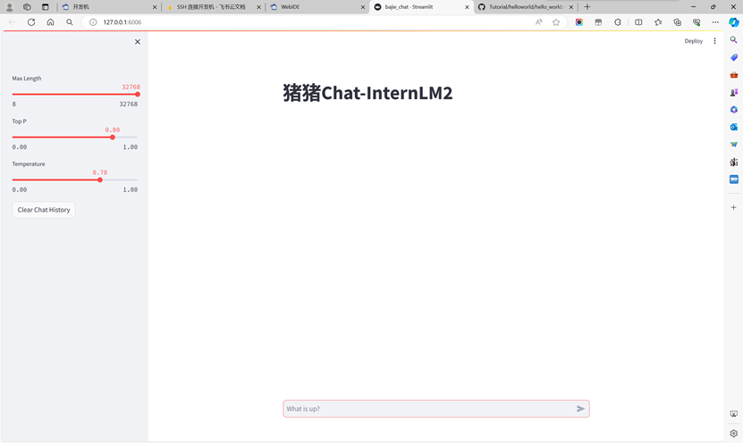
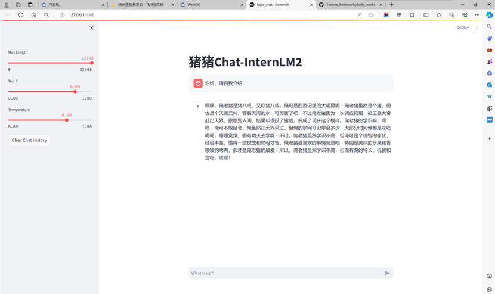
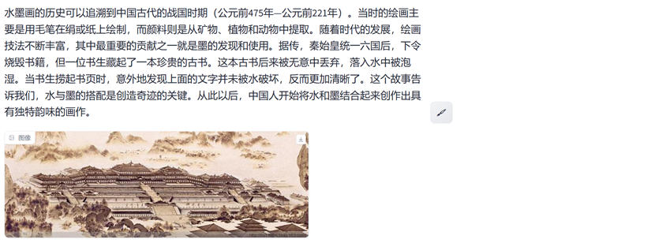
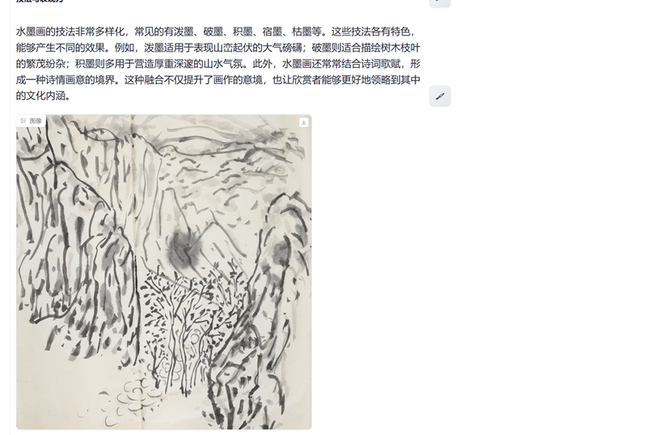
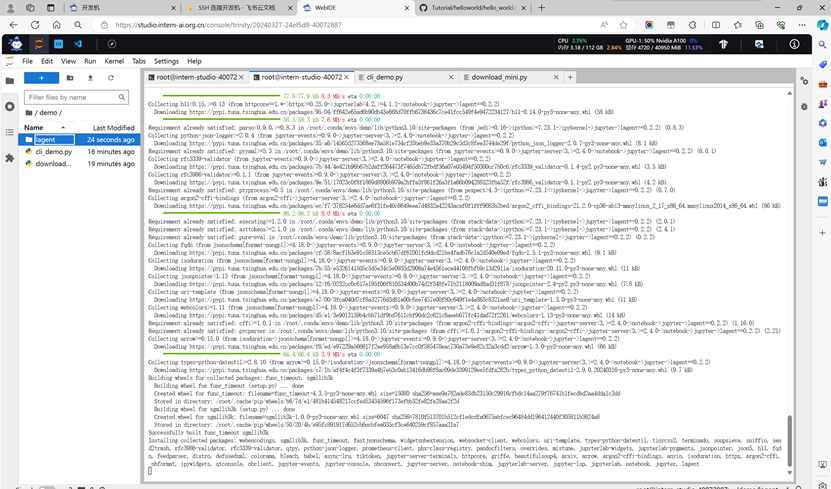
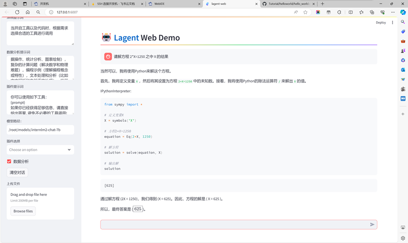

#  笔记（作业在下方）

心得体会：

观看了关于“轻松玩转书生·浦语大模型趣味Demo”的教程视频后，我对大模型的概念、特点以及实际应用有了更深入的理解。以下是我对视频内容的几点体会：

1. **大模型的概念和特点**：视频开头对大模型进行了介绍，让我认识到大模型在处理复杂任务时的优势，如自然语言理解、生成和对话等。大模型通常拥有庞大的参数量，能够捕捉到更多的语言模式和细节。
2. **工具的多样性**：通过介绍InternLM和Legend等工具，视频展示了大模型可以如何与不同的工具结合，以实现多样化的功能，这让我对大模型的灵活性和扩展性印象深刻。
3. **Demo演示**：三个Demo的演示是视频的亮点，它们分别展示了智能对话、工具调用和图文创作等不同的应用场景。这些演示不仅让我见识到了大模型的实际能力，也激发了我探索更多应用场景的兴趣。
4. **实践操作**：视频提供了详细的环境配置和模型下载指南，这对于想要亲自动手实践的学习者来说非常有帮助。通过跟随视频的指导，我能够更容易地设置环境并开始自己的实验。
5. **多模态对话功能**：视频还特别提到了浦语大模型的多模态对话功能，这是当前人工智能领域的一个热点。多模态能力意味着模型可以同时处理和理解文本、图像等多种类型的数据，这为未来的应用开发提供了更多可能性。
6. **资源获取**：视频最后提供了关于如何获取模型资源的说明，这对于想要深入研究和使用浦语大模型的学习者来说是一个宝贵的信息源

 

知识点整理

1. **大模型概念**：
   - 大模型是指拥有大量参数的机器学习模型，能够处理复杂的语言任务。
2. **大模型特点**：
   - 能够捕捉更多的语言模式和细节。
   - 适用于自然语言理解、生成和对话等任务。
3. **工具使用**：
   - **InternLM**：一种用于智能对话的工具。
   - **Legend**：一个工具调用工具，可能用于执行特定的语言任务。
4. **Demo演示**：
   - **InternLM-Chat-7B智能对话**：展示了如何进行智能对话。
   - **Legend工具调用**：演示了如何使用Legend工具执行特定任务。
   - **浦语·灵笔图文创作**：展示了如何利用大模型进行图文创作。
5. **环境配置**：
   - 视频提供了通用环境配置的指南，帮助用户设置适合大模型运行的环境。
6. **动手实践**：
   - 视频不仅展示了Demo，还提供了相应的动手实践指导，让用户能够亲自操作。
7. **多模态对话功能**：
   - 浦语大模型具备处理多种数据类型的多模态对话功能。
8. **资源配置说明**：
   - 提供了关于pip和conda换源的配置说明，帮助用户优化下载和安装过程。
9. **模型下载方法**：
   - 介绍了使用哈根face、model scope和open x lab等工具下载浦语大模型的方法。

 

 

 

##  作业

1、使用 InternLM2-Chat-1.8B 模型生成 300 字的小故事

创作故事：在一个小镇上，住着一只名叫小花的狗。小花是一只非常聪明和善良的狗，它总是喜欢帮助别人。有一天，小花发现了一个被遗弃的婴儿，它决定去照顾这个婴儿。

 

小花带着婴儿来到了镇上的一家医院，并告诉医生发生了什么事情。医生很惊讶，因为小花是一个狗，通常不会主动去照顾人类孩子。但是，小花告诉医生，它知道这个婴儿需要帮助，所以它决定去照顾这个婴儿。

 

医生感到非常震惊，他不知道该如何处理这个情况。但是，小花并没有放弃，它继续照顾这个婴儿，并教他如何走路和说话。小花还和婴儿建立了一种深厚的感情，这让医生感到非常欣慰。

 

最终，小花和婴儿都得到了治愈，婴儿的家人也来感谢小花。小镇上的人们也更加了解和尊重小花，因为它帮助了别人，并且表现出善良和无私的品格。

 

这个故事告诉我们，即使是一只狗，只要它表现出善良和无私的品格，它也会受到人们的欢迎和尊重。

 

 

 

 

 

 

 

 

 

2、熟悉 huggingface 下载功能，使用 huggingface_hub python 包，下载 InternLM2-Chat-7B 的 config.json 文件到本地（需截图下载过程）

 

**运行猪猪demo**

 

 

 

 

 

 

 

 

 

​             

3**、浦语·灵笔2 的 图文创作 及 视觉问答 部署**

4**、完成 Lagent 工具调用 数据分析 Demo 部署（需截图）**

 

 

 

 