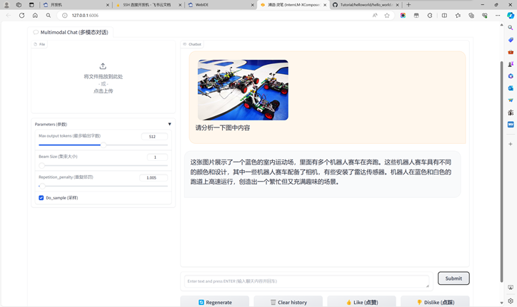

 

**1****、使用 InternLM2-Chat-1.8B 模型生成 300 字的小故事**

创作故事：在一个小镇上，住着一只名叫小花的狗。小花是一只非常聪明和善良的狗，它总是喜欢帮助别人。有一天，小花发现了一个被遗弃的婴儿，它决定去照顾这个婴儿。

 

小花带着婴儿来到了镇上的一家医院，并告诉医生发生了什么事情。医生很惊讶，因为小花是一个狗，通常不会主动去照顾人类孩子。但是，小花告诉医生，它知道这个婴儿需要帮助，所以它决定去照顾这个婴儿。

 

医生感到非常震惊，他不知道该如何处理这个情况。但是，小花并没有放弃，它继续照顾这个婴儿，并教他如何走路和说话。小花还和婴儿建立了一种深厚的感情，这让医生感到非常欣慰。

 

最终，小花和婴儿都得到了治愈，婴儿的家人也来感谢小花。小镇上的人们也更加了解和尊重小花，因为它帮助了别人，并且表现出善良和无私的品格。

 

这个故事告诉我们，即使是一只狗，只要它表现出善良和无私的品格，它也会受到人们的欢迎和尊重。

 

 

 

 

 

 

 

 

 

**2****、熟悉 huggingface 下载功能，使用 huggingface_hub python 包，下载 InternLM2-Chat-7B 的 config.json 文件到本地（需截图下载过程）**

 

**运行猪猪demo**

 

 

 

 

 

 

 

 

 

​             

**3****、浦语·灵笔2 的 图文创作 及 视觉问答 部署**

**4****、完成 Lagent 工具调用 数据分析 Demo 部署（需截图）**

 

 

 

 

 

 

 

 

 

 