- 配置lmdeploy运行环境

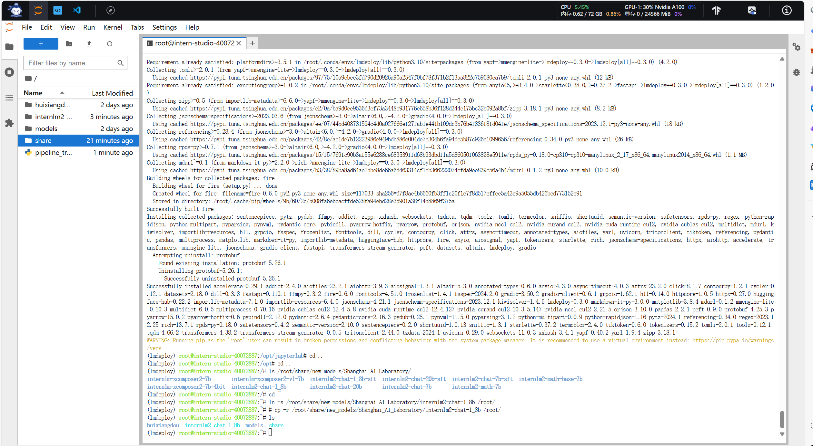

- 下载internlm-chat-1.8b模型

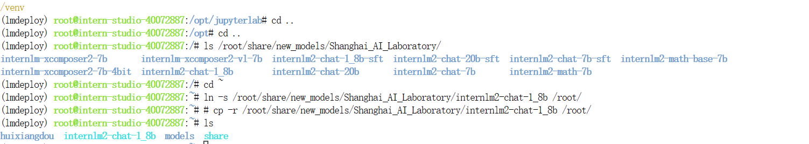

- 以命令行方式与模型对话

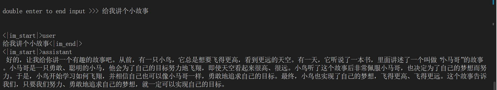

## 进阶作业

完成以下任务，并将实现过程记录截图：

- 设置KV Cache最大占用比例为0.4，开启W4A16量化，以命令行方式与模型对话。（优秀学员必做）

0.8时

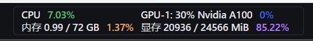

0.4时

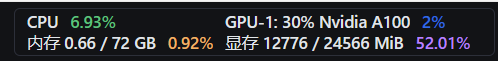

- 以API Server方式启动 lmdeploy，开启 W4A16量化，调整KV Cache的占用比例为0.4，分别使用命令行客户端与Gradio网页客户端与模型对话。（优秀学员）

量化

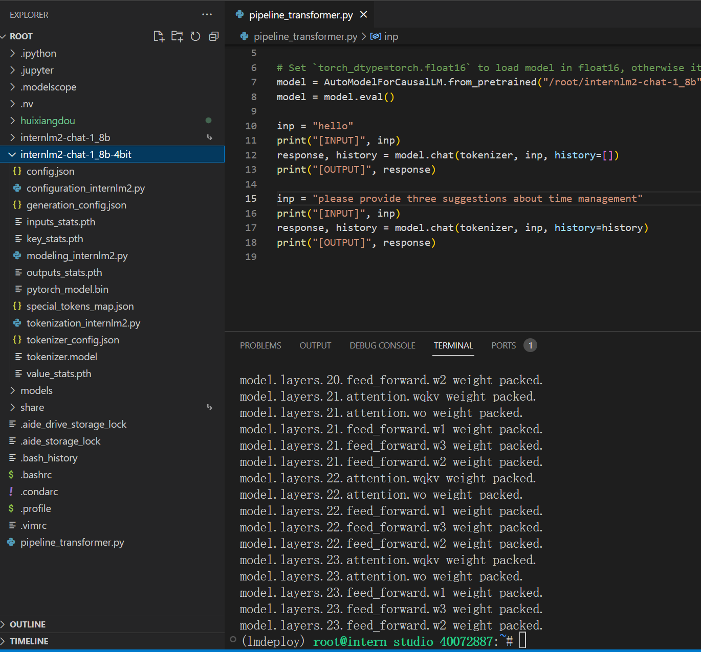

启动客户端

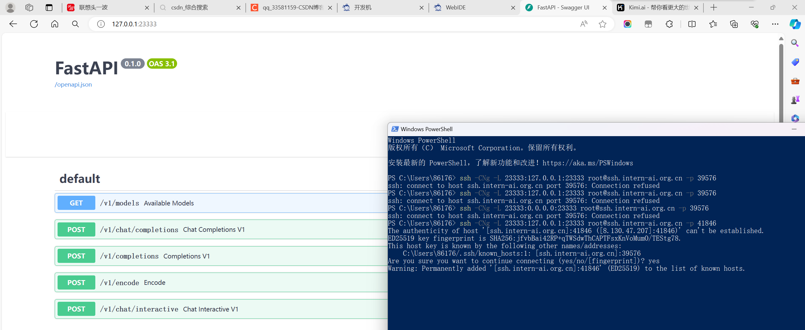

命令行客户端

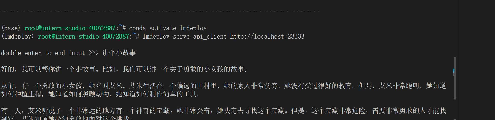

网页端客户端

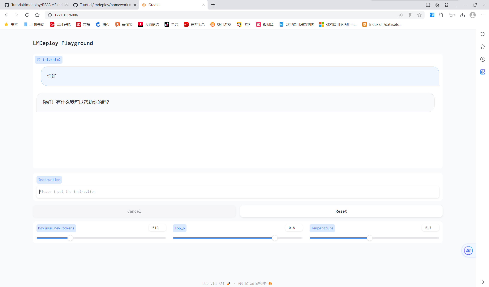

- 使用W4A16量化，调整KV Cache的占用比例为0.4，使用Python代码集成的方式运行internlm2-chat-1.8b模型。（优秀学员必做）

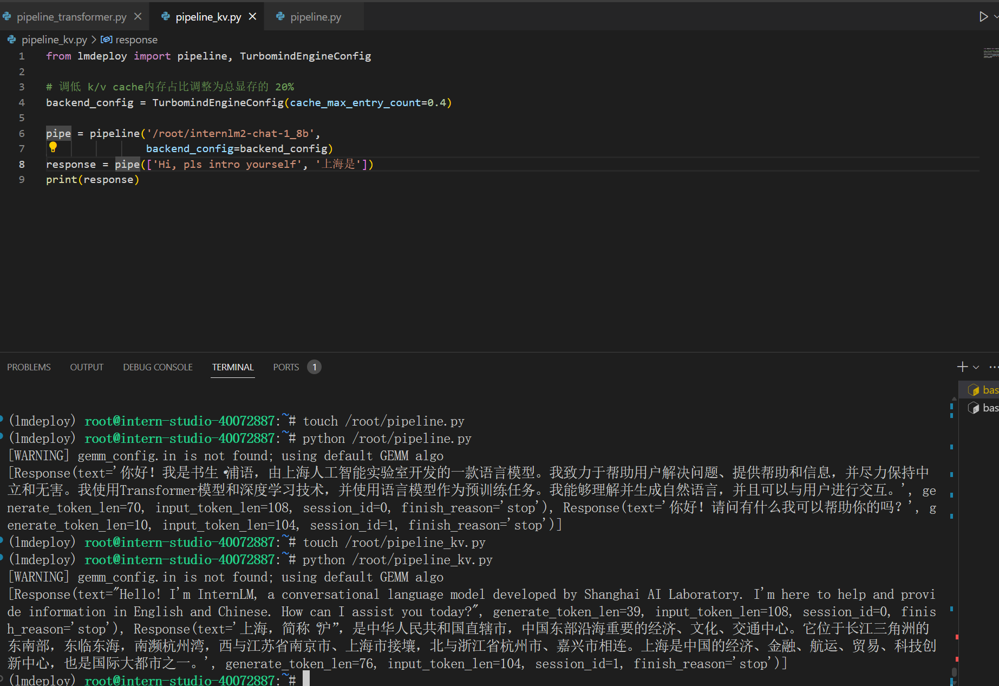

- 使用 LMDeploy 运行视觉多模态大模型 llava gradio demo （优秀学员必做）

命令行

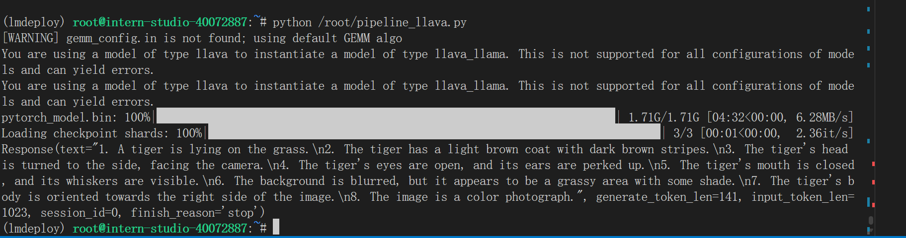

网页端/将 LMDeploy Web Demo 部署到 [OpenXLab](https://github.com/InternLM/Tutorial/blob/camp2/tools/openxlab-deploy) 

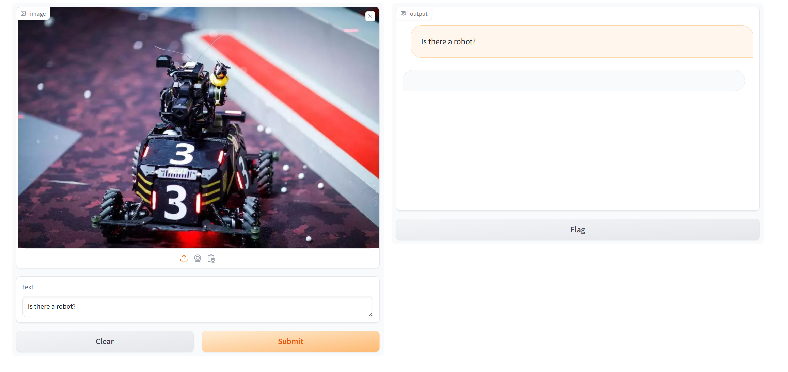

