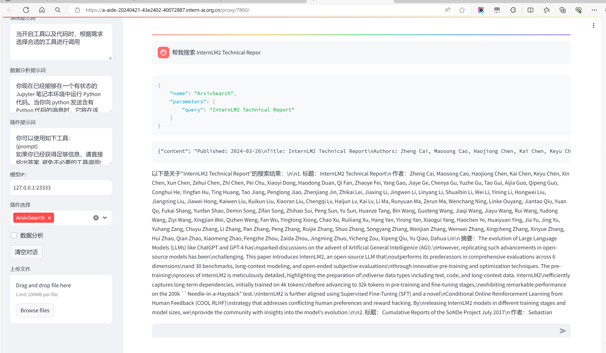
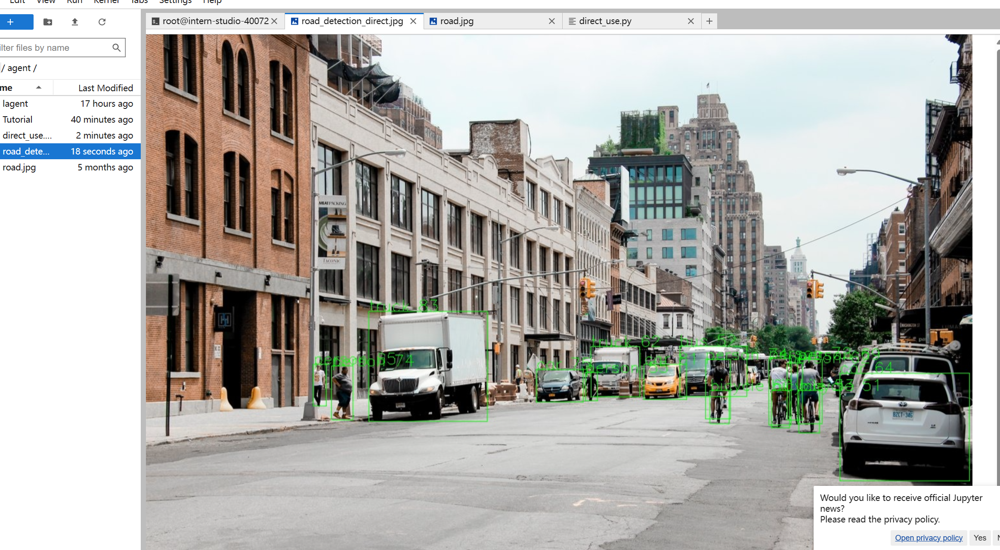
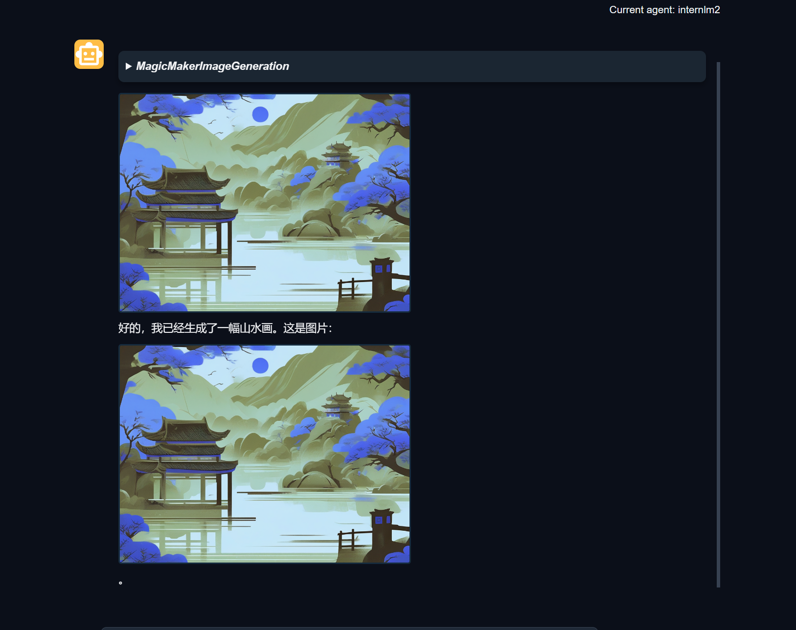
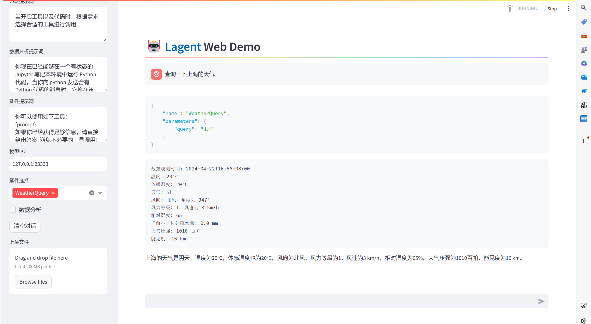
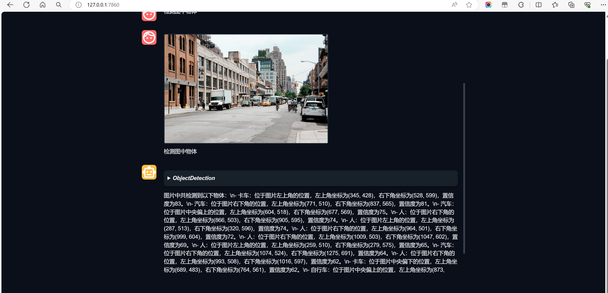

# 笔记（作业在下方）

### 阅读笔记：基于大语言模型的智能体应用

#### 一、智能体应用背景与需求

- **背景介绍**：介绍智能体应用搭建的背景和需求。
- **智能体条件**：智能体需要具备的三个条件：感知环境、采取动作、推理能力。

#### 二、智能体工具包介绍与环境配置

- **工具包介绍**：legend和agent lego两个工具包，用于构建基于大语言模型的智能体应用。
- **环境配置**：开始按照1.4G环境配置部分进行环境配置过程。
- **源码安装**：安装legend和agent lego，选择从源码进行安装。
- **端口映射**：进入legend web demo的部分，按照指示执行代码并进行端口映射。

#### 三、Legend与Agent Lego实战应用

- **端口映射与模型查询**：使用Legend进行端口映射和模型查询。
- **API工具开发**：自定义调用天气API的工具。
- **Agent Lego实战**：完成legend的实战后，进入agent lego的实战部分，准备安装目标检测工具所需依赖。

#### 四、安装过程中的错误处理与脚本创建

- **错误处理**：在安装过程中可能出现的错误，并通过touch方法创建直接使用的脚本。
- **文件编辑**：使用VS Code Server进行文件编辑。
- **智能体工具部署**：最终使用agent lego进行智能体工具的部署。

#### 五、Agent Lego工具配置与API调用

- **端口映射与配置**：如何使用agent lego进行端口映射和工具配置。
- **自定义工具**：演示了如何自定义工具和调用API实现图像生成。

#### 六、智能体的组成与经典案例

- **智能体组成**：讲解智能体的组成，包括感知、决策和行动等部分。
- **经典案例**：介绍智能体的经典案例，重点讲解了legend和agent level的实现和关系。

#### 智能体的局限性与需求

- **局限性**：讨论基于大语言模型的智能体的局限性。
- **需求分析**：分析智能体在实际应用中的需求。

# 作业

## 基础作业

1. 完成 Lagent Web Demo 使用，并在作业中上传截图。文档可见 [Lagent Web Demo](https://github.com/InternLM/Tutorial/blob/camp2/agent/lagent.md#1-lagent-web-demo)

   

   

2. 完成 AgentLego 直接使用部分，并在作业中上传截图。文档可见 [直接使用 AgentLego](https://github.com/InternLM/Tutorial/blob/camp2/agent/agentlego.md#1-直接使用-agentlego)。

## 进阶作业

1. 完成 AgentLego WebUI 使用，并在作业中上传截图。文档可见 [AgentLego WebUI](https://github.com/InternLM/Tutorial/blob/camp2/agent/agentlego.md#2-作为智能体工具使用)。

   

   

2. 使用 Lagent 或 AgentLego 实现自定义工具并完成调用，并在作业中上传截图。文档可见：

   - [用 Lagent 自定义工具](https://github.com/InternLM/Tutorial/blob/camp2/agent/lagent.md#2-用-lagent-自定义工具)

     

   - [用 AgentLego 自定义工具](https://github.com/InternLM/Tutorial/blob/camp2/agent/agentlego.md#3-用-agentlego-自定义工具)

     