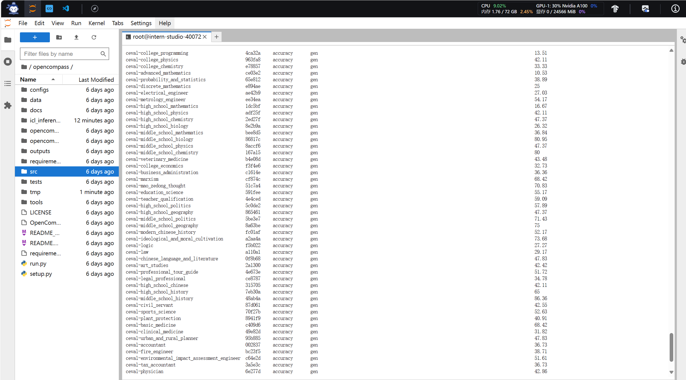
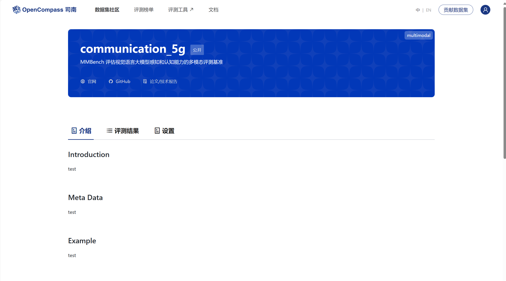

# 笔记（作业在下方）

### 阅读笔记：大模型评测体系与实践

#### 一、大模型评测的重要性

- **评测重要性**：介绍大模型评测的重要性。
- **垂直领域聚焦**：强调需要聚焦垂直领域进行模型评测的必要性。
- **国产评测体系**：提及欧拉评测体系作为唯一国产评测体系的广泛应用。

#### 二、Open PASS评测工具升级

- **工具链升级**：介绍open pass评测工具的全面升级，包括工具链、基准、榜单等。
- **自定义功能**：支持自定义模型和数据集，以及任务的并行化处理。
- **自研数据集**：介绍自研数据集，如max bench和critical bench，注重梯度难度和知识能力的评测。

#### 三、使用OpenAI API进行评测

- **API评测流程**：如何使用OpenAI的API进行自然语言处理任务的评测。
- **参数指定**：需要指定的数据集、模型路径、token net路径等。
- **评测启动**：通过命令行和Python方式启动评测，结果的查看和总结。

#### 四、Open Compass执行流程与自建数据集

- **执行流程**：Open Compass的执行流程，关注PARTITIONER、open fl、runner、SUMMARIZER和tasks等文件。
- **数据集实现**：实现新数据集需要修改CONFIG、DATASET和PY文件，并返回包含dict和REVT的list。
- **Python实现**：在PY文件中需要import新实现的类，完成数据集的实现。

#### 五、实现新数据集的方法

- **修改要点**：需要修改的三个地方，包括类名和import语句。
- **数据集逻辑**：实现数据集的读取和格式化，返回DATASET dict。
- **遍历与处理**：遍历所有子集，读取相应文件并拼接处理。

#### 司南评测体系2.0的特点

- **实现方法**：详细讲解了司南评测体系2.0的实现方法。
- **特点介绍**：介绍司南评测体系2.0的特点，如垂直领域聚焦、自定义功能、自研数据集等。

# 作业

### 基础作业

- 使用 OpenCompass 评测 internlm2-chat-1_8b 模型在 C-Eval 数据集上的性能

### 进阶作业

- 将自定义数据集提交至OpenCompass官网

